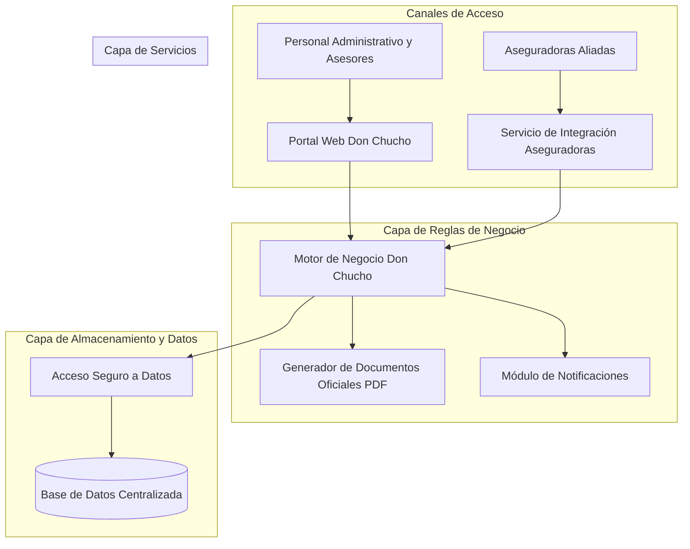

# Don Chucho HealthCare 🩺

### *Plataforma Integral de Gestión de Pólizas, Clientes y Recaudos de Salud.*

---

## 📌 1. ¿Qué es Don Chucho HealthCare?

**Don Chucho HealthCare** es una solución informática integral diseñada para modernizar, automatizar y centralizar la administración de pólizas de seguros y servicios de salud.

El sistema actúa como el núcleo operativo para entidades aseguradoras, agencias intermediarias y oficinas de atención, permitiendo coordinar de punta a punta el ciclo de vida del asegurado: desde la inscripción del cliente y la contratación de planes de salud o ramos afines, hasta el seguimiento financiero de pagos, emisión de comprobantes oficiales y la integración directa con aseguradoras aliadas.

---

## 🎯 2. ¿Qué problema busca solucionar?

En el sector asegurador y de salud asistencial, la gestión manual o la dispersión de datos en múltiples hojas de cálculo suele generar fricciones operativas críticas. **Don Chucho HealthCare** responde a las siguientes necesidades del negocio:

* **Dispersión y desorganización de la información:** Evita el uso de registros aislados en papel o archivos de oficina, reuniendo los datos de clientes, pólizas vigentes y seguros en un repositorio unificado y confiable.
* **Control deficiente de cobros y cartera morosa:** Proporciona un registro claro de cada abono o cuota, permitiendo identificar en tiempo real pagos al día, pagos pendientes o usuarios con cuotas atrasadas para una oportuna gestión de cobranza.
* **Tiempos prolongados en la emisión de certificados:** Elimina la confección manual de documentos; el sistema genera de forma instantánea certificados de afiliación y recibos de caja en formato digital (PDF) con la identidad corporativa de la empresa.
* **Aislamiento con las compañías de seguros:** Resuelve la falta de canales automáticos con las aseguradoras aliadas mediante un canal de consulta remota que permite a los aliados auditar clientes y pólizas suscritas sin fricción.
* **Falta de seguridad y control de personal:** Garantiza que solo el personal autorizado (administradores, asesores o directores) acceda a la información según su nivel de responsabilidad, resguardando datos personales sensibles.

---

## ⚙️ 3. ¿Qué hace el sistema? (Módulos Principales)

El sistema ofrece una experiencia clara y estructurada a través de sus diferentes áreas operativas:

### 👤 Administración de Clientes y Afiliados

* Registro completo de titulares con su tipo y número de documento de identificación (cédula, pasaporte, NIT, etc.).
* Gestión de datos de contacto (teléfono, correo electrónico, dirección) y fecha de nacimiento.
* Estado del cliente (activo/inactivo) y trazabilidad de su historial de vinculación.

### 🩺 Catálogo de Seguros y Planes

* Configuración de diferentes modalidades de cobertura: Salud, Vida, Hogar, Automóvil, entre otros.
* Detalle de costos, vigencia en meses, red de aseguradoras aliadas y desglose de beneficios y exclusiones del plan.

### 📄 Gestión y Emisión de Pólizas

* Contratación y vinculación formal entre un cliente y el seguro de su preferencia.
* Control estricto de las fechas de inicio, culminación y ciclo de vida de la póliza (Vigente, Vencida, En Renovación o Cancelada).
* Módulo de auditoría para cancelaciones, registrando el motivo administrativo formal de cualquier baja.
* Emisión automática del **Certificado de Póliza Oficial** en PDF listo para ser entregado o enviado al usuario.

### 💰 Control de Recaudos y Pagos

* Registro de pagos asociados a cada póliza con múltiples métodos (Efectivo, Tarjeta, Transferencia electrónica, Cheque).
* Emisión de **Recibos de Pago Digitales** en PDF con número de comprobante único para el cliente.
* Búsqueda ágil y auditoría por número de comprobante para conciliaciones de caja.

### 📊 Reportes Gerenciales y Analítica

* Informes de ventas y recaudación por tipo de seguro.
* Detección automática de pagos atrasados calculando los días de retraso frente a la fecha esperada.
* Estadísticas de los seguros más demandados y distribución general de pólizas según su estado operativo.

### 🌐 Conector de Integración para Aseguradoras (Canal Externo)

* Servicio de consulta directa que permite a las compañías aseguradoras conectarse de manera segura para consultar:
  * Pólizas activas pertenecientes a su firma.
  * Listado de clientes afiliados a sus coberturas.
  * Detalle de contratos vigentes por asegurado.

---

## 🏛️ 4. Arquitectura del Sistema

Para garantizar que la plataforma sea segura, estable y fácil de evolucionar en el tiempo, se diseñó bajo una **Arquitectura en Capas Independientes (Multicapa)**.

En términos sencillos, el sistema no mezcla la pantalla visible con la base de datos ni con las operaciones internas; cada parte cumple una labor especializada y se comunica ordenadamente con la siguiente:

### ¿Cómo funciona cada nivel?

1. **Capa de Presentación (Portal Web):** Es la cara visible del sistema. Los asesores y directivos interactúan con pantallas intuitivas y organizadas por menús temáticos para registrar clientes, emitir pólizas o registrar pagos.
2. **Capa de Reglas de Negocio (El cerebro operativo):** Contiene la lógica y las normas de la empresa. Verifica que un documento sea válido, que las fechas de vigencia sean coherentes, produce los certificados en PDF y procesa los cálculos de carteras.
3. **Capa de Servicios de Integración (Web Service):** Actúa como una ventanilla electrónica para que los sistemas de las aseguradoras asociadas consulten datos en tiempo real sin requerir acceso manual a las pantallas del sistema.
4. **Capa de Datos y Base de Datos (Custodio de la información):** Se encarga exclusivamente de guardar, actualizar y consultar los registros en la base de datos de manera segura y confidencial.
5. **Capa de Entidades (Lenguaje común):** Define los conceptos que todo el sistema comparte (Cliente, Seguro, Póliza, Pago, Usuario) para que todas las capas "hablen el mismo idioma".

---

## 💻 5. Tecnologías Utilizadas

La solución ha sido construida con tecnologías de alto estándar empresarial, reconocidas por su madurez, estabilidad y soporte a largo plazo:

| Área                            | Tecnología                                  | Rol y Beneficio en el Negocio                                                                                                                                 |
| :------------------------------- | :------------------------------------------- | :------------------------------------------------------------------------------------------------------------------------------------------------------------ |
| **Plataforma Base**        | Microsoft .NET Framework & C#                | Entorno corporativo robusto que garantiza un alto rendimiento, seguridad de datos y confiabilidad en la ejecución de procesos.                               |
| **Interfaz de Usuario**    | ASP.NET Web Forms + HTML5/CSS3               | Proporciona un entorno web accesible desde navegadores, optimizado para el trabajo administrativo diario.                                                     |
| **Base de Datos**          | MySQL                                        | Sistema gestor de base de datos relacional de gran velocidad y fiabilidad para resguardar miles de registros de forma íntegra.                               |
| **Generación Documental** | Motor iText                                  | Librería especializada en la creación dinámica de documentos PDF de calidad profesional (certificados oficiales y recibos de pago con sellos y membretes). |
| **Interoperabilidad**      | Servicios Web XML / SOAP (ASMX)              | Estándar de comunicación que permite a aplicaciones de terceros (aseguradoras) interoperar de forma estructurada y segura.                                  |
| **Seguridad de Acceso**    | Autenticación basada en Formularios y Roles | Control riguroso de inicio de sesión para impedir accesos no autorizados y proteger la confidencialidad médica y financiera.                                |

---

## 🌟 6. Beneficios de la Solución

* **Agilidad Operativa:** Disminuye en más de un 70% el tiempo que un asesor invierte en emitir una póliza y entregar comprobantes al cliente.
* **Cero Papel:** Todos los recibos y certificados se expiden en formatos digitales estandarizados listos para su envío por correo o descarga.
* **Transparencia Financiera:** Control detallado de los ingresos por caja y detección instantánea de pagos morosos.
* **Escalabilidad:** Permite incorporar nuevas aseguradoras aliadas y nuevos tipos de coberturas sin necesidad de reconstruir el sistema.

---

> **Don Chucho HealthCare** — *Cuidamos lo que más valoras, facilitando la administración de tu bienestar.*
